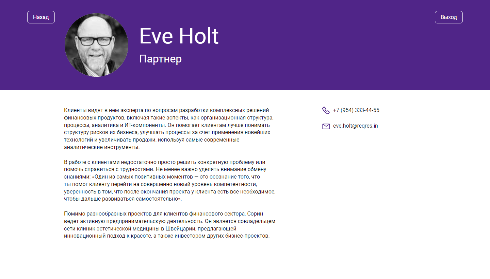

# My Team

## Оглавление

- [Обзор проекта](#обзор-проекта)
  - [Задачи проекта](#задачи-проекта)
  - [Функциональность проекта](#функциональность-проекта)
  - [Ограничения в функциональности связанные с использованием ReqRes API](#ограничения-в-функциональности-связанные-с-использованием-reqres-api)
  - [Screenshot](#screenshot)
  - [Директории проекта](#директории-проекта)
  - [Запуск проекта](#запуск-проекта)
  - [Ссылки](#ссылки)
- [Ход выполнения проекта](#ход-выполнения-проекта)
  - [Используемые технологии](#используемые-технологии)
- [Автор](#автор)

## Обзор проекта

### Задачи проекта

Создать приложение отображающие список пользователей получаемых от [ReqRes API](https://reqres.in), а также страницу детального просмотра профиля.

### Функциональность проекта

Функционально проект представляет SPA-приложение которое отображает на главной странице список пользователей. По клику на карточку пользователя можно зайти на детальную страницу его профиля. Поскольку в проекте использовалось Fake API это наложило серьёзные ограничения на возможности некоторых действий пользователя. Более подробно смотри раздел [Ограничения в функциональности связанные с использованием ReqRes API](#ограничения-в-функциональности-связанные-с-использованием-reqres-api).

Функциональность:

- Возможность регистрации пользователя
- Возможность аутентификации пользователя
- Возможность просмотра карточки пользователя
- Если пользователь является владельцем карточки, то у него есть возможность поменять свой аватар
- Возможность лайкнуть и снять лайк с карточки пользователя
- Пагинация карточек пользователей зависящая от разрешение экрана пользователя

### Ограничения в функциональности связанные с использованием ReqRes API

- Регистрация и аутентификация пользователя возможно только с применением email-адреса уже имеющегося в базе ReqRes API, например `eve.holt@reqres.in`. Пароль можно указать произвольный.
- Поскольку в ReqRes API нельзя записать информацию, все действия пользователя связанные с отправкой данных (постановка и снятие лайка, редактирование аватара) лишь имитируют отправку данных. Все обновлённые данные записываются в `localStorage`, и доступны пока пользователь не вышел из аккаунта.
- Поскольку ReqRes API не предоставляет в данных пользователей информацию о них, то на странице детального просмотра профиля, информация о пользователе захардкодена (за исключением email)

### Screenshot

### Директории проекта

- `src/assets` — директория со статичными файлами
- `src/components` — директория с компонентами
- `src/contexts` — директория с элементами контекста
- `src/hooks` — директория с пользовательскими хуками
- `src/lib` — директория с файлами библиотек
- `src/pages` — директория с корневыми файлами страниц
- `src/utils` — директория со вспомогательными файлами

### Запуск проекта

- `npm run build` — запуск проекта в режиме продакшн, с формированием файлов подготовленных к деплою в директории `/build`
- `npm start` — запуск проекта в режиме разработки

### Ссылки

- [Ссылка на репозиторий проекта](https://github.com/Bjorn86/testing-antipoff-group)
- [Ссылка на демо-страницу проекта](https://bjorn86.github.io/my-team-spa/)

## Ход выполнения проекта

### Используемые технологии

- HTML
- CSS
- JS
- [React](https://react.dev/)
- [React Router](https://reactrouter.com/en/main)
- [react-hook-form](https://react-hook-form.com/)
- [validator](https://www.npmjs.com/package/validator)
- Адаптивная вёрстка
- Семантическая вёрстка

## Автор

**Данила Легкобытов**

- e-mail: [legkobytov-danila@yandex.ru](mailto:legkobytov-danila@yandex.ru)
- Telegram: [@danila_legkobytov](https://t.me/danila_legkobytov)
- LinkedIn: [in/danila-legkobytov](https://www.linkedin.com/in/danila-legkobytov/)
